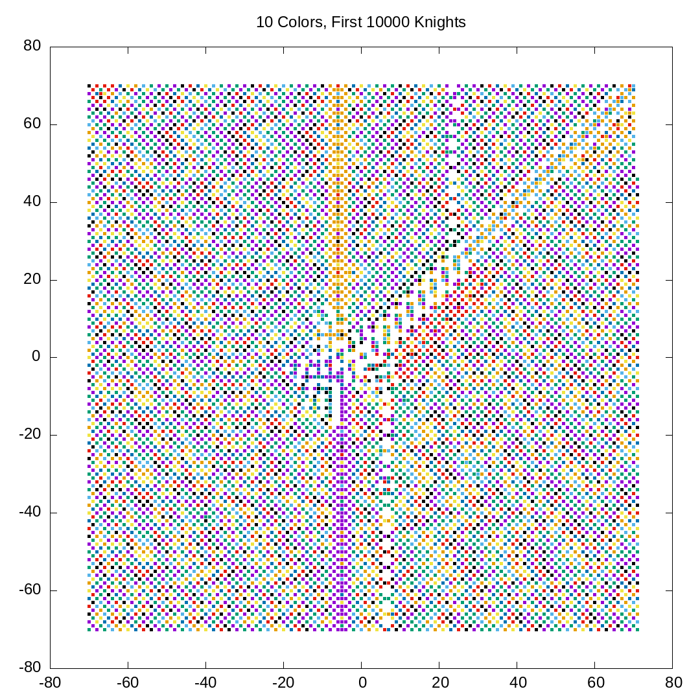
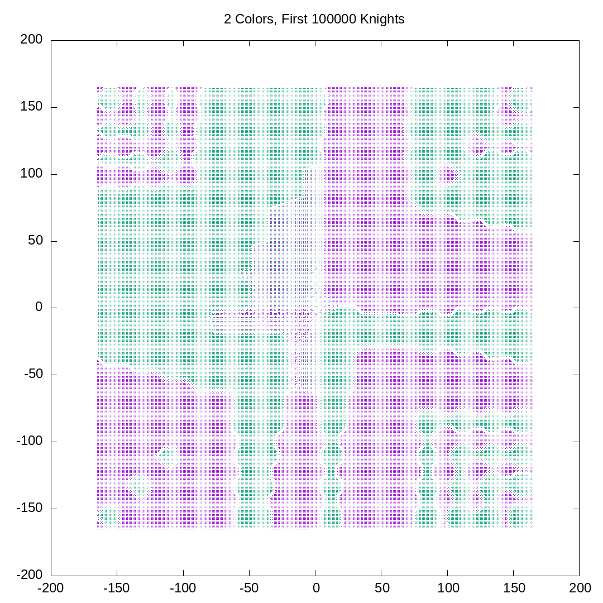

# Placing Differently Colored Chess Knights in a Spiral
For two or more colors, consider placing knights on an infinite chessboard, spiraling out from the
center.

The colors take turns placing knights. Each color places a knight at the earliest possible place in
the spiral that is both not occupied and is not attacked by a knight of another color.

What is the resulting placement of the knights?

Inspired by [this Numberphile video][1].





Requirements:

- make
- /bin/sh
- gnuplot
- a C++20 compiler

The convention is file names `C@K.png` for `C` colors and `K` knights, e.g. for 2 colors and 1000 knights:
```console
$ make 2@1000.png
```

[1]: https://www.youtube.com/watch?v=UiX4CFIiegM

